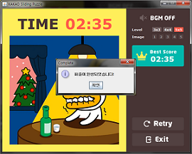
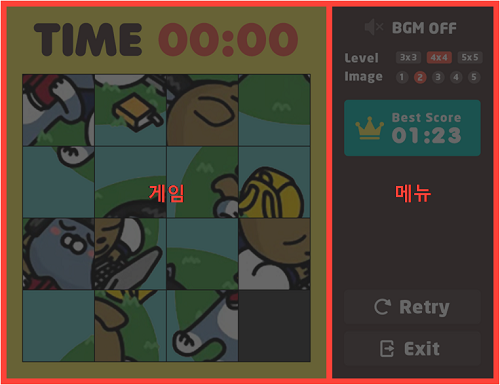
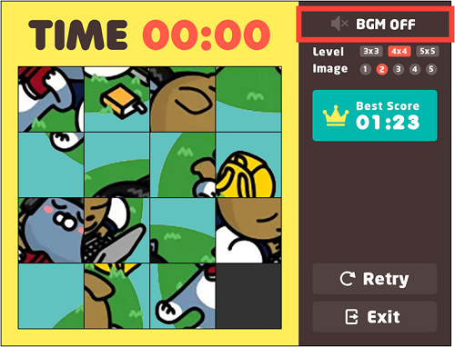
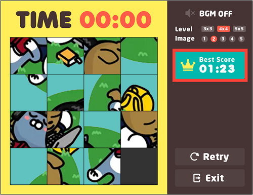

# Sliding Puzzle (Java)
자바로 제작한 간단한 퍼즐 게임  

  
  
  
---
  
### 1. 팀원 및 역할
어다희 - 최고 점수 기능, 발표 및 보고서 제작 참여  
전영민 - 배경음악 기능 (시간이 부족하여 종료 부분 미완성)  
윤나래 - 위의 기능을 제외한 모든 기능, UI 디자인, PPT 및 보고서 제작, 클래스 통합
  
### 2. 프로젝트 일정
  
2015년 11월 1주차 ~ 2015년 12월 2주차  
※ 월요일, 금요일 주 2회 정기적 모임을 통해 회의
  
### 3. 유의사항
MS949로 작성되었습니다.
  
  
### 4. 저작권
퍼즐 이미지 - 카카오
  
---
  
### 제안 배경
어릴 적 조그마한 직사각형 판에 놓인 조각들을 하나씩 상하좌우로 움직여가며 퍼즐을 맞췄던 기억이 있을 것입니다.  
어떤 어이디어로 팀프로젝트를 기획할까 생각해보다가 슬라이딩 퍼즐을 JAVA로 구현해보기로 결정하습니다. 
  
  
### 제안 목적
패널과 레이블 그리고 버튼을 이용해 UI를 그리며,  
각각의 퍼즐 이미지 조각을 액션 리스너를 통해 조작함으로써 수업 시간에 배운 내용을 복습했습니다.  
또한 각각 맡은 모듈을 개발하고, 통합시켜봄으로써  
여러 사람과 개발 프로젝트를 진행할 때의 협업 프로세스를 익히려고 합니다. 
  
  
### Class Diagram
  
이번 프로젝트를 통해 객체지향적 코딩을 처음 해봤습니다.  
그래서 어떤 것을 클래스로 만들고 어떤 것을 메소드로 만들지 판단이 잘되지 않았습니다.  
실제 코딩을 하면서 새로운 변경 사항들이 많이 생겨 클래스 다이어그램을 수정했습니다.  
설계 초기와 달리 추가로 구현된 ImageButton 클래 스는 이미지 교체를 쉽게 하기 위해서 만들었고,  
MyConstants는 수업 시간에 배운 것처럼 상수를 효율적으로 관리하기 위해 만들었습니다.
  
  
### UI 기능 및 메소드  
게임은 한 화면에서 좌측의 게임 부분과 우측의 메뉴 부분을 통해 모든 기능이 실행됩니다. 
  
  
**[게임]**  
  
게임 처음에 Init 함수에서 게임을 초기화하고 Grid Layout으로 배치한 뒤 퍼즐을 무작위로 섞는 shuffle 함수를 사용합니다.  
액션 리스너를 이용해 퍼즐을 누르면 move 함수를 호출합니다.  
퍼즐을 처음 누르는 순간 스레드를 이용한 타이머가 실행됩니다.  
처음에 퍼즐을 페인트 컴포넌트를 이용해서 그리고,  
마우스 리스너를 사용할 생각으로 퍼즐을 ‘끌어서’ 이동하게 하려 했으나  
구현 초기에 버튼으로 바꾸고 액션 리스너를 사용해 ‘클릭’시 이동하게 만들었습니다.
  
**[메뉴-음악]**  
  
BgmThread에서 Player를 통해 mp3 외부 파일을 import 해서 decoding 시킵니다.  
버튼을 클릭하면 PrimaryPanel의  sound 함수를 통해  
count값이 짝수인지 홀수냐인지에 따라 배경음악을 끄고 켤 수 있습니다.  
액션 리스너를 통해 count값을 변경했습니다.  
세 가지 곡을 순차적으로 반복 재생 할 계획이었으나 음악을 재생하고 마침에 있어서  
시스템상에서 어떠한 signal도 주지 않아서 구현에 어려움이 있었습니다. 따라서 한 곡을 재생하는 것으로 변경하였습니다.  
BgmPanel을 생성해서 그 안에 버튼을 담을 계획이었으나 구현을 하다 보니 패널을 따로 만들 필요가 없어서  
메뉴 패널에 바로 버튼으로 추가하는 방식으로 구현했습니다.
  
**[메뉴-레벨과 이미지]**  
  
메뉴의 레벨을 선택하면 바뀐 난이도에 따라 퍼즐을 새로 init 합니다.  
이미지를 선택하면 ImageButton 클래스의 setImageIcon 함수를 통해  
퍼즐의 현재 상태에서 이미지만 교체해서 보여줍니다.  
마우스 리스너의 entered, exited를 통해 배경색을 조정합니다. 
  
**[메뉴-최고 점수]**  
  
퍼즐이 완성될 때마다 분과 초의 값을 가지고 있는 변수를 최고 점수의 변수와 비교합니다.  
먼저 분을 비교하고 값이 작으면 초를 비교한 뒤 최고 점수 변수로 저장합니다.  
발표 때와 달리 각 레벨별로 성공한 최고 점수를 보여주도록 변경했습니다.
  
**[메뉴-재시작과 종료]**  
  
재시작 버튼을 선택하면 현재 레벨과 이미지에 맞게 개임을 새로 init 합니다.  
게임 종료 버튼을 누르면 시스템을 exit 합니다. 마우스 리스너의 entered, exited를 통해 배경색을 조정합니다. 
  
  
### 발표 질문 답변  
##### (1) shuffle 함수는 자바에서 제공하는 함수를 사용했는가  
 직접 함수를 정의해서 사용했습니다.  
  
##### (2) 그렇다면 shuffle 함수에서 랜덤을 사용하는가  
 퍼즐의 데이터 값을 1차원 배열로 0, 1, 2, … 순서로 완성되었을 때의 데이터를 우선 넣어놓았습니다.  
 그 후에 shuffle 함수에서 현재 설정된 레벨 값에 따른 2차원 배열의 크기 (xlen, ylen) 내에서  
 x, y 변수에 랜덤 값을 뿌려 주고, 이 값을 이용해 move 함수를 호출합니다.  
 move 함수는 받은 값(x, y)을 이용해 다시 1차원 배열 인덱스 형식(i)으로 변환한 뒤,  
 이동할 수 있는 퍼즐인지 아닌지 판별하고 이동할 수 있는 퍼즐이면 빈칸과 교체합니다.  
  
##### (3) move 함수에서 빈칸과 퍼즐을 교체할 때 어떻게 하는가  
 빈칸도 다른 퍼즐 조각과 마찬가지로 빈칸 이미지를 갖고 있는 이미지 버튼으로 구현했습니다.  
 따라서 퍼즐 교체 시 temp 변수를 통해 swap 합니다.  
 후 전체 퍼즐의 이미지를 다시 set 하는 것이 아니라  
 바뀌어야 될 두 값만 이미지 교체를 한 뒤 repaint 메소드를 호출하는 방식입니다. 
  
##### (4) 최고 점수가 각 레벨별로 저장이 되는가  
 발표 당시 모든 레벨을 통틀어 하나의 최고 점수만 보여준다고 답변했습니다.  
 제안서를 다시 확인해 보니 각 레벨별로 성공한 최고 점수를 보여주기로 계획했었고,  
 실수로 이 부분 구현이 안 되어있어 최종 보고서 제출의 코드는 각 레벨별로 최고 점수를 보여주도록 수정했습니다.  
  
##### (5) 배경음악에서 사용한 메소드는 무엇인가
 play 메소드를 사용했고 Player는 Jlayer.1.0.1에 있습니다. 
  
##### (6) 배경음악에서 카운트를 쓴 부분에 대해 설명을 다시 부탁한다.  
 Boolean의 경우 해당하는 변수를 찾아서 그 변수 값을 바꿔줘야 하는 반면에  
 count는 해당하는 변수를 찾아서 그것을 1만큼 증가시키면 되기 때문에 효율적으로 사용할 수 있습니다.  
 따라서 Boolean 타입을 사용하지 않고 count를 하는 방식으로 구현했습니다. 
